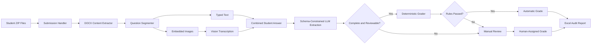

# Hybrid AI Grading Pipeline

> **From messy ZIP submissions and handwritten equations to structured, reviewable grades—without removing the teaching assistant from the decision loop.**

Grading a written assignment sounds straightforward until the submissions begin arriving.

One student types every equation directly into the document. Another solves the problem on paper and pastes a photograph into a table cell. A third uses different notation, rounds every value differently, or places the final answer several lines away from the calculation that produced it. The mathematics may be structured, but the way students communicate that mathematics rarely is.

This project was built for that gap.

The **Hybrid AI Grading Pipeline** is an end-to-end grading assistant for Microsoft Word submissions. It accepts batches of student ZIP files, extracts typed text and embedded images from each `.docx` file, uses a vision-capable language model to transcribe handwritten work, converts the combined answer into a strict structured representation, applies deterministic grading rules wherever possible, and sends uncertain cases to a human reviewer.

The central idea is intentionally simple:

> **AI should help recover and organize the evidence. It should not silently invent the grade.**

The language model is used for tasks that are naturally ambiguous—reading handwriting, recognizing notation, and mapping a student's response into known fields. Once those fields are available, ordinary Python code performs the actual comparison. Missing values, unsupported conclusions, incomplete calculations, or answers outside the configured tolerance are surfaced for manual review rather than being forced into an automatic decision.

---

## Why This Project Exists

Traditional grading scripts work well when every answer is already structured. They struggle when the input is a human-created document containing paragraphs, tables, screenshots, handwritten equations, and inconsistent formatting.

A fully LLM-based grader can read those submissions, but it introduces a different problem: the model may interpret, correct, or judge an answer in ways that are difficult to reproduce. Even a well-written prompt does not provide the same transparency as an explicit rule such as “accept this value within a tolerance of 1.5.”

This project combines the strengths of both approaches.

The AI layer handles perception and extraction. The deterministic layer handles repeatable grading. The manual-review layer handles ambiguity. The Excel output preserves an audit trail containing the student answer, assigned score, grading method, and reason.

The result is not a replacement for a teaching assistant. It is a grading workflow designed to reduce repetitive work while keeping consequential decisions visible and reviewable.

---

## What the Pipeline Does

For every ZIP file placed in the raw submissions directory, the pipeline performs the complete grading workflow:

1. It discovers the available submission archives and processes them as a batch.
2. It extracts each archive into a clean temporary directory.
3. It removes common macOS metadata such as `__MACOSX` and `.DS_Store`.
4. It verifies that the archive contains exactly one Word document.
5. It reads paragraphs, tables, table cells, and embedded images in document order.
6. It locates the boundaries of each assignment question using recognizable prompt text.
7. It separates typed text from image-based work for every question.
8. It sends embedded answer images to a vision-capable OpenAI model for transcription.
9. It combines typed text and transcribed handwriting into one answer representation.
10. It asks the model to extract only the required values using strict JSON schemas.
11. It compares those extracted values with deterministic answer rules and tolerances.
12. It pauses for manual review when information is missing, calculations are unsupported, or a rule fails.
13. It appends the final results to an Excel workbook.
14. It clears temporary student files before moving to the next submission.

A failure in one submission does not stop the entire batch. The pipeline reports the error, performs cleanup, and continues processing the remaining files.

---

## System Architecture



The architecture deliberately separates **document understanding**, **answer extraction**, **grading**, and **reporting**. Each stage has one responsibility, making the system easier to inspect, test, and adapt.

---

## A Submission’s Journey

Imagine a student uploads a ZIP archive containing a Word document. Their answer to one question is typed, but their expected-utility calculations are handwritten and inserted as a photograph.

The submission handler first opens the archive and normalizes its contents. The DOCX extractor then walks through the document in its original order. It records paragraphs, table rows, cell text, and every embedded image. Images are preserved as bytes and tagged with useful metadata such as dimensions, format, file size, and SHA-256 hash.

The answer segmenter searches the document for known question text. Everything between two question boundaries becomes that question’s answer section. Paragraph text and table-cell text are collected, while images remain attached to the section in which they appeared.

The answer extractor sends each image to the vision model with a narrow instruction: transcribe exactly what the student wrote, preserve equations and notation, do not solve the problem, and mark unreadable symbols as `[unclear]`. That transcription is then joined with the typed response.

Next, the LLM extraction layer receives the combined answer, the task, the reference solution, extraction instructions, and a strict JSON schema. It is not asked to freely grade the response. It is asked to identify specific evidence—for example, the student’s value for `EU(x)`, their selected decision, or the value they reported for `VOI(B)`.

Finally, the deterministic grader compares the extracted evidence with explicit expected values. When all required fields satisfy the rules, the question receives an automatic score. When a field is missing, the student shows no relevant calculations, or a value falls outside tolerance, the teaching assistant sees the reference solution, the student response, and the reason for escalation before entering a grade and note.

That combination provides speed without pretending uncertainty does not exist.

---

## Current Assignment Coverage

The repository is currently configured for a specific Bayesian-network and decision-network written assignment with four graded sections.

| Question | Evidence extracted                                                                                 | Automatic grading rule                                          |
| -------- | -------------------------------------------------------------------------------------------------- | --------------------------------------------------------------- |
| `1`      | Final Bayesian-network factorization                                                               | Normalized exact comparison with the configured factorization   |
| `2.A`    | Six conditional-probability-table values and evidence of calculations                              | Exact numeric comparison with zero tolerance                    |
| `2.B`    | Expected utilities for `x`, `y`, and `z`, selected best decision, and calculation evidence         | Numeric comparison within a tolerance of `2`, plus decision `x` |
| `2.C`    | Expected utilities without information, MEU values, VOI, calculation evidence, and extraction note | Numeric comparison within a tolerance of `1.5`                  |

This makes the project immediately useful for the included assignment, but the architecture is designed so that prompts, schemas, boundaries, and deterministic rules can be replaced for another structured written assignment.

---

## Repository Structure

```text
TA Project/
├── main.py                         # Batch orchestration and pipeline entry point
├── config.py                       # Directory paths and model configuration
├── requirements.txt                # Python dependency list
├── .env.example                    # Environment-variable template
├── LICENSE                         # MIT License
├── grading_pipeline.ipynb          # Early exploration and pipeline prototyping
│
├── engine/
│   ├── submission_handler.py       # ZIP discovery, extraction, cleanup, validation
│   ├── docx_extractor.py           # Ordered paragraph, table, and image extraction
│   ├── answer_segmenter.py         # Assignment-specific question boundary detection
│   ├── answer_extractor.py         # Vision transcription and answer combination
│   ├── llm_extractor.py            # Strict schema-based evidence extraction
│   ├── deterministic_grader.py     # Reproducible grading rules and tolerances
│   ├── manual_review.py            # Interactive human-review fallback
│   └── excel_writer.py             # Persistent Excel result export
│
├── prompts/
│   ├── grading_items.py            # Tasks, reference answers, extraction instructions
│   └── schema.py                   # JSON schemas for structured model responses
│
├── output/
│   └── print_intermediate.py       # Utility for inspecting extracted answers
│
└── data/
    ├── submissions/
    │   ├── raw/                    # Place student ZIP files here
    │   └── extracted/              # Temporary extraction directory
    ├── templates/                  # Original assignment template
    ├── temporary/                  # Intermediate JSON artifacts
    └── results/                    # Generated Excel grade workbook
```

---

## Core Design Decisions

### 1. Preserve Document Order

A Word document is not simply a collection of paragraphs. Answers may be located inside tables, and images may appear between pieces of text. The extractor walks through low-level paragraph and table blocks in document order so the recovered answer more closely matches what the student submitted.

### 2. Treat Handwriting as Source Material, Not a Prompt to Solve

The vision instruction explicitly asks for transcription rather than correction. This distinction matters. If the student writes an incorrect equation, the system should preserve that equation instead of replacing it with a mathematically correct one.

### 3. Use the LLM as a Structured Evidence Extractor

Every question has a strict JSON schema. The model must return the requested fields and cannot add arbitrary keys. Numeric values remain numeric, missing evidence becomes `null`, and selected decisions are constrained to known options.

### 4. Grade with Explicit Python Rules

Expected answers and tolerances live in `engine/deterministic_grader.py`. These rules are visible, reproducible, and easy to audit. The same structured answer always produces the same deterministic result.

### 5. Escalate Instead of Guessing

A question is routed to manual review when a required field is `null`, when the response lacks recognizable calculations, or when deterministic checks fail. The reviewer receives both the reference solution and the recovered student answer before assigning the final grade.

### 6. Preserve an Audit Trail

The final workbook stores the student identifier, question ID, grade, maximum points, grading method, full extracted answer, and grading reason. A reviewer can later see not only the score but also how that score was produced.

---

## Getting Started

### Prerequisites

Use Python 3.10 or later and an OpenAI API key with access to the Responses API and image input.

The project imports the following third-party packages:

```text
openai
python-docx
python-dotenv
Pillow
openpyxl
```

### 1. Clone the Repository

```bash
git clone <your-repository-url>
cd "TA Project"
```

### 2. Create a Virtual Environment

On macOS or Linux:

```bash
python3 -m venv .venv
source .venv/bin/activate
```

On Windows PowerShell:

```powershell
python -m venv .venv
.venv\Scripts\Activate.ps1
```

### 3. Install Dependencies

```bash
python -m pip install --upgrade pip
python -m pip install openai python-docx python-dotenv Pillow openpyxl
```

You may also add these packages to `requirements.txt` and install them with:

```bash
python -m pip install -r requirements.txt
```

### 4. Configure the API Key

Create a `.env` file in the project root:

```env
OPENAI_API_KEY=your_openai_api_key_here
```

The `.env` file is ignored by Git. Never commit a real API key to the repository.

### 5. Add Student Submissions

Place one or more ZIP archives in:

```text
data/submissions/raw/
```

Each ZIP archive must contain exactly one `.docx` file. The document may contain typed responses, embedded images, or both.

A descriptive filename helps the current student-name parser. A recommended pattern is:

```text
LastName_FirstName_CS579_Written01.zip
```

### 6. Run the Pipeline

```bash
python main.py
```

The program processes every ZIP file in the raw submissions directory. Questions that pass all deterministic checks are graded automatically. Questions requiring judgment pause in the terminal and display the relevant review context.

---

## Manual Review Experience

When a question cannot be graded safely, the terminal displays the question identifier, reference solution, recovered student answer, reason automatic grading was not accepted, and maximum available points.

The reviewer then enters a numeric score and an optional note. The note becomes part of the final audit record.

A typical escalation may occur because a value was missing, handwriting was unclear, the model could not confidently associate a number with the requested field, the student listed answers without showing the required work, or the extracted value did not satisfy the configured deterministic rule.

---

## Output

Results are appended to:

```text
data/results/grading_results.xlsx
```

The workbook contains the following columns:

| Column           | Description                                        |
| ---------------- | -------------------------------------------------- |
| `Student ID`     | Student name inferred from the submission filename |
| `Question ID`    | Assignment question or subsection                  |
| `Grade`          | Final numeric score                                |
| `Maximum Points` | Maximum score for the question                     |
| `Grading Method` | `automatic` or `manual`                            |
| `Student Answer` | Combined typed text and image transcription        |
| `Reason`         | Automatic rule result or reviewer note             |

Intermediate extraction data is written to `data/temporary/` during processing. Temporary files and extracted submission contents are cleared after each student, including when processing fails.

---

## How Structured Extraction Works

The project uses a separate schema for every question. For example, a decision question can require a response shaped like this:

```json
{
  "eu_x": 94.9,
  "eu_y": 22.48,
  "eu_z": 32.47,
  "best_decision": "x",
  "calculations": true
}
```

This object is not the grade. It is a structured representation of what the student wrote.

The extraction prompts repeatedly instruct the model to preserve incorrect values, return `null` for missing information, avoid silently recalculating answers, and distinguish unsupported final values from visible mathematical work. That structured evidence is then passed to the deterministic grader.

This separation is one of the most important properties of the system. It makes the model’s role narrower and makes the final grading behavior easier to explain.

---

## Adapting the Pipeline to Another Assignment

The current implementation is assignment-specific by design. To support a new assignment, update the following layers.

### Step 1: Define Question Boundaries

Edit `engine/answer_segmenter.py` so each question can be located using stable text from the assignment template. Add the corresponding slices and question IDs to the returned `answers` dictionary.

### Step 2: Write the Grading Items

Edit `prompts/grading_items.py`. Each grading item should contain a unique question ID, maximum points, original task, reference answer, and narrow extraction instructions describing exactly what the model should recover.

Prompts should tell the model to extract the student’s answer rather than repair it.

### Step 3: Create Strict Schemas

Edit `prompts/schema.py` and define the exact JSON structure expected for each question. Use numeric fields for numeric evidence, enumerations for limited choices, and nullable fields when evidence may be absent.

### Step 4: Add Deterministic Rules

Edit `engine/deterministic_grader.py`. Add expected values, tolerances, required decisions, and comparison logic. Keep rules explicit enough that another reviewer can understand why an answer passes or escalates.

### Step 5: Test with Different Answer Styles

Test typed answers, images, tables, missing work, wrong calculations, unusual notation, rounding differences, and unreadable handwriting. A robust grading workflow must be tested not only with correct answers but also with realistic student mistakes.

---

## Reliability and Responsible Use

This project handles educational records and potentially identifiable student work. Before using it in a real course, confirm that the workflow complies with institutional policies, data-retention rules, and any applicable privacy requirements.

Student submissions are sent to an external model API during transcription and structured extraction. Do not use real student data unless that processing is permitted. Remove unnecessary identifiers where possible, restrict access to generated workbooks, and avoid committing raw submissions, temporary artifacts, result files, or API credentials.

Automated output should always remain reviewable. The pipeline is designed to assist a qualified grader, not to make unchallengeable academic decisions.

---

## Current Limitations

The project currently assumes that every ZIP archive contains exactly one Word document. Other formats such as PDF, scanned multipage files, and handwritten standalone images are not supported directly.

Question segmentation depends on recognizable assignment text. If a student removes or substantially edits the prompt headings, the segmenter may fail to locate the answer boundaries.

The grading configuration is specific to the included Bayesian-network assignment. Supporting another assignment requires new prompts, schemas, boundaries, and deterministic rules.

The current manual-review interface runs in the terminal. It is functional but not yet suited for multiple graders, distributed review, role-based access, or browser-based workflows.

Vision transcription quality depends on image clarity. Low-resolution photographs, cropped equations, heavy shadows, and ambiguous handwriting may still require direct inspection of the original document.

The generated workbook appends new rows on every run. Reprocessing the same submissions can therefore create duplicate records unless deduplication is added.

The repository does not yet include a comprehensive automated test suite, model-response evaluation set, cost report, or performance benchmark.

---

## Roadmap

Potential next steps include:

* a web dashboard for reviewing flagged answers;
* direct links from the review screen to the original answer image;
* confidence scores and reason codes for every extracted field;
* assignment configuration through YAML or JSON rather than Python edits;
* support for PDFs and standalone image submissions;
* duplicate-submission detection and idempotent Excel writes;
* parallel processing with API rate-limit controls;
* automated tests for document extraction, segmentation, grading, and cleanup;
* per-question grading rubrics and partial-credit rules;
* model-cost and token-usage reporting;
* reviewer authentication and immutable audit logs; and
* export formats compatible with learning-management systems.

---

## Development History

The project evolved in stages. It began as an exploratory notebook for opening student archives, walking through DOCX blocks, locating question boundaries, and comparing assignment templates with submitted documents.

The next stage converted those experiments into reusable modules and introduced vision-based transcription for handwritten answers. The final stage added batch processing, strict schema-based extraction, deterministic grading, manual review, Excel export, and cleanup between students.

That progression reflects the philosophy of the repository itself: begin by understanding the real shape of the data, isolate each responsibility, and automate only the decisions that can be made transparently.

---

## Contributing

Contributions are welcome, especially in document parsing, grading reliability, evaluation tooling, privacy-preserving workflows, user-interface design, and automated testing.

When proposing a grading rule, include examples of correct work, common mistakes, ambiguous responses, and cases that should be escalated. In this project, a good contribution is not merely one that increases automation. It is one that makes the system more predictable, explainable, and safe to review.

---

## License

This project is available under the MIT License. See `LICENSE` for details.

---

## Final Perspective

The most difficult part of automated grading is not calculating whether `94.9` is close to `94.92`. Python can do that reliably.

The difficult part is finding the student’s intended value inside a document containing tables, screenshots, handwriting, inconsistent notation, and incomplete reasoning—and then knowing when the recovered evidence is trustworthy enough to use.

This project approaches that problem by giving each tool the role it handles best:

* the document parser preserves structure;
* the vision model reads what ordinary text extraction cannot;
* the language model organizes unstructured work into explicit evidence;
* deterministic code applies repeatable rules;
* and the teaching assistant handles ambiguity.

That is what makes the pipeline hybrid—and what keeps the human grader meaningfully in control.
